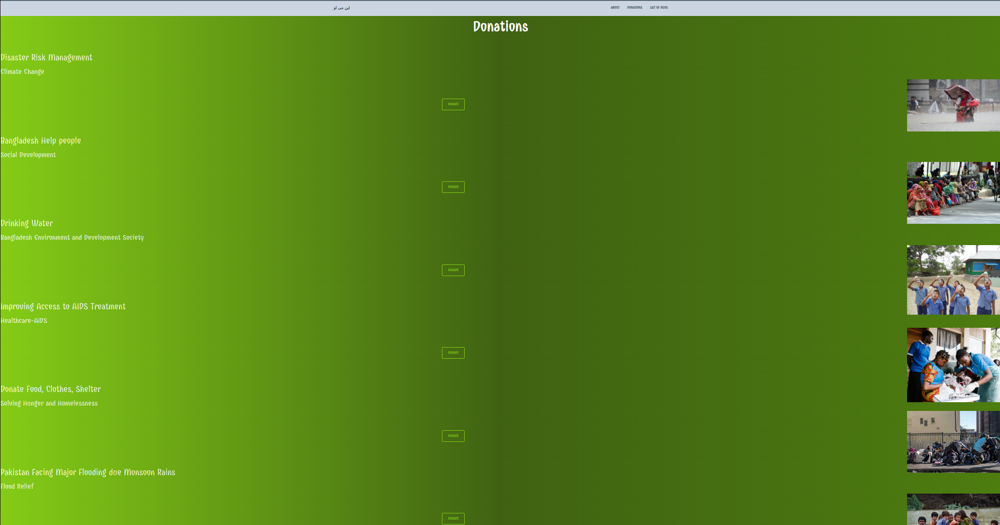
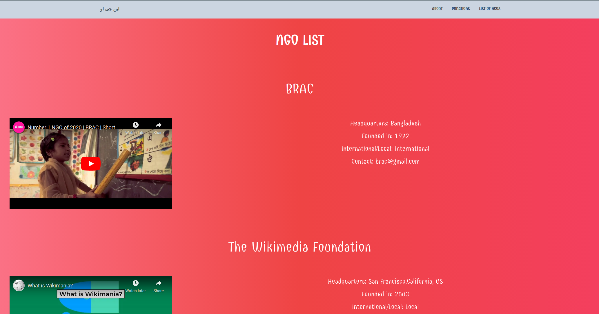
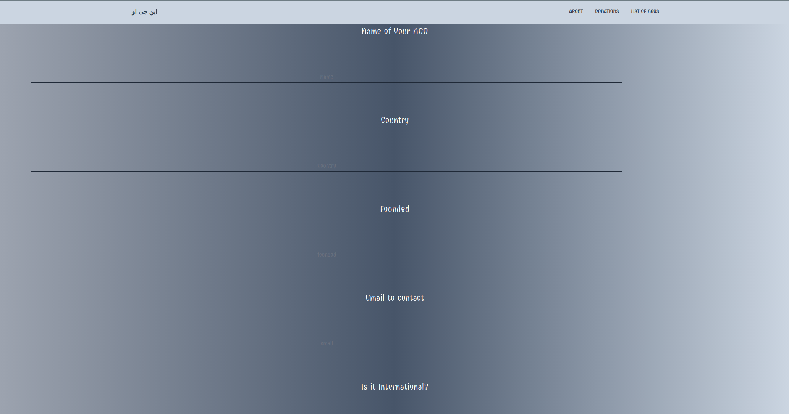
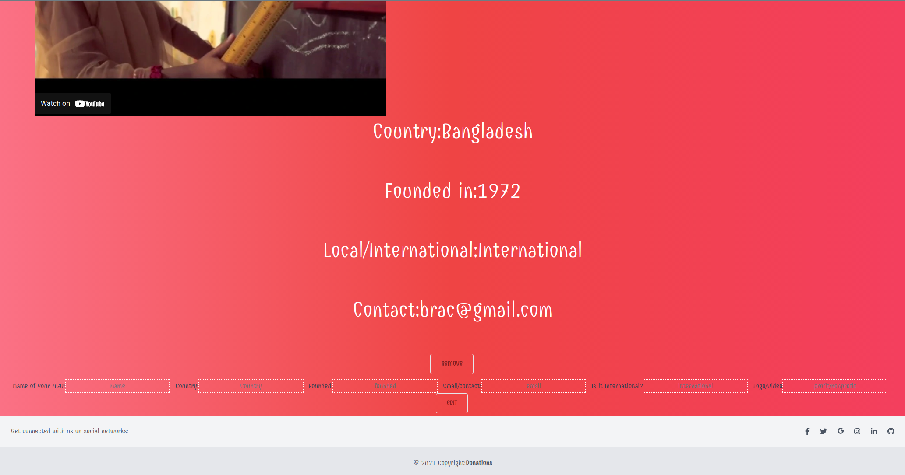

# NGO

#### By
### Maham Khan [LinkedIn](https://www.linkedin.com/in/mahamakhan/)  | [Github](https://github.com/mahamakhan)

---
### **_Getting Started_**
#### [ERD](https://drive.google.com/file/d/1j2_thImyaYARksdwc7nsi91IIZhg4IqA/view?usp=sharing)
#### [Trello](https://trello.com/b/UXMspA9m/ngo)
#### [CHD](https://drive.google.com/file/d/1e39UerYn0GRhvoiyoMu2pj3mr9o8ag_r/view?usp=sharing)

---
### **_Description_**
#### List of NGO with details to give charity. Add your own NGO, delete it or update details.   
#### 

### **_Technologies Used_**
- Django
- Vue.js
- Postgres
- Tailwind

---
### **_Screenshots_**
#### Image 1

#### Image2

#### Image 3

#### Image 4

---

### **_Screenshots_**
- Add payment method
- 

---
### **_Credits_**

---

#### [background](https://tailwind-gradient-generator.vercel.app/gradient?colors=violet-300,purple-700,violet-900&direction=R)
#### [videos](https://www.youtube.com/)
#### [Info](https://www.ifrc.org/)
#### [Info](https://donate.sfmfoodbank.org/page/32140/donate/1?ea.tracking.id=DigAd2223-PS?&&utm_campaign=sept_ham&utm_medium=paidads&utm_source=search&utm_content=R&ea.tracking.id=DigAd2122-PS&utm_source=google&utm_campaign=15025456744&utm_medium=ad&utm_content=619031204589&utm_term=donate&ea.tracking.id=DigAd2223-GO&gclid=Cj0KCQjwguGYBhDRARIsAHgRm48179vWE6Z_UJm-_hTlmexMINbCdRDF95han894TFLQ1nRXBGVvpyYaAjAgEALw_wcB)
#### [Info](https://www.care.org/our-work/education-and-work/)
#### [Info](http://www.brac.net/)
#### [Info](https://www.wango.org/)
#### [Tailwind](https://www.creative-tim.com/learning-lab/tailwind-starter-kit/documentation/css/navbars)
#### [Tailwind](https://tailwindcss.com/docs/content)
#### [Tailwind](https://tailwind-elements.com/docs/standard/navigation/navbar/)
#### [API](https://www.programmableweb.com/api/give-food-rest-api-v1)
#### 
#### 
#### 
#### 
#### 
#### 
#### 
